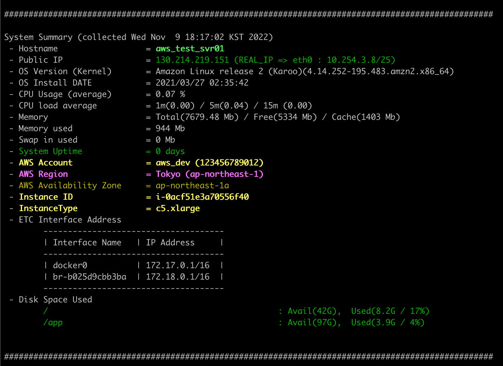

# # stat_banner
Linux System Stat Banner
+ One time banner output when logging in to the system
> Sample Stat Banner    
</img>

## Download & Install & pre running
```
cd {Install_PATH}
wget https://github.com/HonamSong/stat_banner/archive/refs/tags/latest.tar.gz
tar xvfz latest.tar.gz
cd stat_banner
sh system_stat.sh
```

## Add to Cron.d
```
echo "*/1 * * * * root /bin/bash {Install_PATH}/stat_banner/system_stat.sh"  > /etc/cron.d/system_stat_banner
```

## Aws Account info
On Aws Instance Account Info
```
$ cat {Install_PATH}/stat_banner/aws_info.json

#Sample
{
  "aws": {
    "account": {
      "{ACCOUNT_ID}": "AWS_ACCOUNT_ALIAS_NAME",
      "123456789012": "AWS_aa_account",
    },
    "region": {
      "us-east-1": "Virginia",
      "us-east-2": "Ohio",
      "us-west-1": "Califonia",
      "us-west-2": "Oregon",
      "af-south-1": "CapeTown",
      "ap-east-1": "HongKong",
      "ap-south-1": "Mumbai",
      "ap-southeast-1": "Singapore",
      "ap-southeast-2": "Sydney",
      "ap-northeast-1": "Tokyo",
      "ap-northeast-2": "Seoul",
      "ap-northeast-3": "Osaka",
      "ca-central-1": "Central",
      "eu-central-1": "Frankfurt",
      "eu-west-1": "Ireland",
      "eu-west-2": "London",
      "eu-west-3": "Paris",
      "eu-south-1": "Milan",
      "eu-north-1": "Stockholm",
      "me-south-1": "Bahrain",
      "sa-east-1": "SaoPaulo"
    }
  }
}
```


## Warning Banner
Change the banner Text is variable "warning_text"
```
$ {Install_path}/stat_banner/security_banner.cfg
...skip
# Banner Message  
warnning_text=(  
"Unauthorized access to this system is forbidden and will be prosecuted by law."  
"By accessing this system, you agree that your actions may be monitored if unauthorized usage is suspected."  
)
...skip
```

+ Disable warning_banner is delete a file "{Install_path}/stat_banner/security_banner.cfg" 

### Sample warning Banner
</img>


